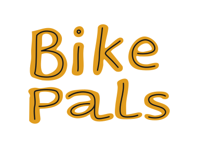

# Bike Pals

## Mission Statement:
"At Bike Pals, we’re more than just a bike shop—we’re a hub for cyclists,  and tinkerers. Founded by two lifelong friends with a love for bikes and community, our shop is all about bringing people together. Here, you’ll find more than tools and repairs; you’ll find shared laughter, great conversations, and a welcoming old-school vibe. Whether you’re fixing a flat, swapping parts, or just hanging out, Bike Pals is your go-to spot to connect, have fun, and keep the wheels spinning."

This website helps people from new joiners to bike enthusiasts to find a place where they can buy and repair their bikes while joining to the cycling community. 

IMG mockups on devices AI generated

## Features

- The project was created based on the [Bike Pals project board](https://github.com/users/demetermarcell/projects/3).

### Navigation Bar
- Present on all pages, allowing users to navigate on the site.
- Navbar contains the following elements:
    - Brand Logo
    - Home
    - Services
    - Prices
    - Contact Us
    - Book a Stand - button to highlight this is an important feature of the site
- The navbar is responsive across all screen sizes.
- The navbar elements are responsive to user actions. (on-hover, on-click effects)

### Landing Page Hero Section
- Includes a photograph and the mission statement to communicate the vibe and the goal of the company to the user.
- Responsive across all screen sizes. 

### Services Section
- Includes 4 decorative cards to inform the visitor about the services and products our company offers.
- Services:
    - Repairs - The shop offers full range of repair and maintenance services. The user can jump to the Prices page selecting the provided link on the card. 
    - Bikes - The shop keeps an inventory of 40+ bikes.
    - Components & Apparels - The company distributes everythign a customer needs for his/her bike or for cycling.
    - Tinker with Us - The company's special feature, to offer bike stands to rent where customers can work on their bike with all necessary tools, grease, cleaners provided. The user can jump to the "Book a Stand" page to make a reservation.
- The Service cards are responsive on all screen sizes.
### Footer
- Present on all pages, allowing the users to easily extract contact information at any point of their visit on the site.
- The footer contains the following elements:
 - Brand Logo - aesthetic and marketing reasons
 - Social Media icons - redirect user to the social media sites of the shop, opening in a new tab.
 - Opening Hours - provide information on the opening hours schedule
 - Contact Us - provide phone, mail and address information decorated with FontAwesome icons.
 - Find Us - embeded google maps iframe to visually support clients to find the shop.
- The footer section is responsive on all screen sizes.
- Clicking the email addresss triggers the mail client.

### Prices
-Includes a price table with categorized repairs for easy understanding for the user.
    - The table has 3 columns: 
        - Category 
        - Service 
        - Price
    - The table has 6 categories:
        - Packages
        - Drivetrain
        - Wheel
        - Suspension
        - Brakes
        - Other
-Includes Modal windows to describe what's included in the  service packages.

### Book a Stand
- Includes a photograph with the description and price of the service to inform the user.
- Includes a Form that allows the user to make a reservation on the service.
- The Form has the following attributes:
 - Name - text
 - Email - email
 - Phone - number
 - Date - date picker
 - Time - dropdown
 - Hours - dropdown
- All form attributes are mandatory.
- When the user fills the form correctly and submits it, he/she gets redirected to the Success page.
- Both pages are responsive on all screen sizes.

## Testing
text comes here
### Validator Testing
text comes here
### Manual Testing
text comes here
### Unfixed Bugs
text comes here
## Deployment
- The site was deployed to GitHub pages as per steps below:
    - In the GitHub repository navigate to the Settings tab.
    - Select the Pages option from the "Code and automation" section.
    - Select the following options and hit Save.
        - Source: Deploy from a branch
        - Branch: main
        - Folder: /(root)
    - After hitting Save, the first push will be deployed. ( and each push after that)
    - You can track deployed versions from the GitHub repository by navigating to the Deployments from the right column.
    
## Credits
### Content
- Text content was created by Marcell Demeter with the aid of [ChatGPT](https://chatgpt.com/)
- User stories were created by Marcell Demeter
- Code for the responsive navbar is based on [Code Institute Love Running](https://github.com/Code-Institute-Solutions/love-running-v3) training project and the following code snipet [LINK](https://www.geeksforgeeks.org/how-to-make-responsive-navbar-menu-in-css/)
- Code for the hero section is based on [Code Institute Love Running](https://github.com/Code-Institute-Solutions/love-running-v3)
- Code for the responsive Service cards and Footer sections are based on:
    - [Code Institute Boardwalk Games](https://github.com/Code-Institute-Solutions/boardwalk-games-v1-sourcecode\) training project
    - Bootstrap v5.3.3 [Cards](https://getbootstrap.com/docs/5.3/components/card/),[Grid](https://getbootstrap.com/docs/5.3/layout/grid/) and [Tables](https://getbootstrap.com/docs/5.3/content/tables/) functions. 
- Icons for the footer were taken from [Font Awesome](https://fontawesome.com/)
- Code for the Success page is based on [Code Institute Boardwalk Games](https://github.com/Code-Institute-Solutions/boardwalk-games-v1-sourcecode\) training project.
- Code for the Book a Stand page is based on:
    - [Code Institute Boardwalk Games](https://github.com/Code-Institute-Solutions/boardwalk-games-v1-sourcecode\) training project
    - Bootstrap v5.3.3 [Forms](https://getbootstrap.com/docs/5.3/forms/overview/) function
- Code for the Prices section is based on Bootstrap v5.3.3:
    - [Tables](https://getbootstrap.com/docs/5.3/content/tables/) function
    - [Modal](https://getbootstrap.com/docs/5.3/components/modal/) function

### Media
- All images were generated with [Midjourney](https://www.midjourney.com) (prompts by Marcell Demeter)
- Favicon was generated with [Midjourney](https://www.midjourney.com) and converted with [Favicon.io](https://favicon.io/)
- Logo file and social media icons were created by [Réka Imre](https://www.instagram.com/imreka_works/) based on the AI generated Hero image.
- Mockups were created by Marcell Demeter

